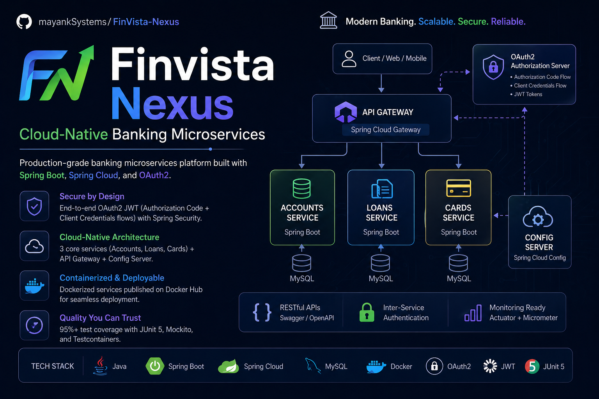

<div align="center">



<br/>

# FinVista Nexus

### Cloud-Native Banking Microservices Platform

**Production-grade distributed banking system — built for scale, secured by design, observable by default.**

<br/>

[](https://www.java.com)
[](https://spring.io/projects/spring-boot)
[](https://spring.io/projects/spring-cloud)
[](https://kubernetes.io)
[](https://hub.docker.com)
[](https://www.keycloak.org)
[](https://junit.org/junit5/)
[](LICENSE)

<br/>

[Overview](#-overview) · [Architecture](#-architecture) · [Services](#-core-services) · [Security](#-security-architecture) · [Setup](#-local-setup) · [Docs](#-api-documentation)

</div>

---

## 🧭 Overview

FinVista Nexus is a **production-grade, event-driven banking microservices platform** that mirrors real-world fintech infrastructure. Built to demonstrate deep backend engineering across distributed systems, security, observability, and resilience — not as a demo, but as a deployable system.

**What makes this production-grade:**
- End-to-end **OAuth2 JWT security** with inter-service authentication — zero trust between services
- **Circuit breakers, retries, and rate limiting** via Resilience4j — graceful degradation under load
- **Centralized configuration** with live refresh — no restarts needed for config changes
- **Distributed tracing** with OpenTelemetry — full request lifecycle visibility across services
- **Event-driven communication** via Kafka and RabbitMQ — decoupled, idempotent message processing
- **95%+ test coverage** with unit, integration, and container-level tests

---

## 🏗 Architecture

### 📌 Architecture Diagram

> *Place system architecture diagram here — recommended: draw.io export or the banner image above*

```
┌─────────────────────────────────────────────────────────────────┐
│                      Client / Web / Mobile                      │
└───────────────────────────────┬─────────────────────────────────┘
                                │
                    ┌───────────▼────────────┐
                    │      API Gateway        │  ← Spring Cloud Gateway
                    │  (Rate Limiting, Auth)  │  ← Resilience4j
                    └──┬──────────┬──────┬───┘
                       │          │      │
          ┌────────────▼─┐  ┌─────▼──┐  ┌▼──────────┐
          │   Accounts   │  │ Loans  │  │   Cards   │
          │   Service    │  │Service │  │  Service  │
          └──────┬───────┘  └───┬────┘  └─────┬─────┘
                 │              │              │
          ┌──────▼──────────────▼──────────────▼──────┐
          │              MySQL (per service)           │
          └────────────────────────────────────────────┘
                       ↑                    ↑
          ┌────────────┴──────┐  ┌──────────┴──────────┐
          │   Config Server   │  │  Eureka (Discovery) │
          │ Spring Cloud Cfg  │  │   Service Registry  │
          └───────────────────┘  └─────────────────────┘
                       ↑
          ┌────────────┴──────────────────────────────┐
          │           OAuth2 / Keycloak               │
          │  Authorization Code + Client Credentials  │
          └───────────────────────────────────────────┘
```

**Traffic Flow:** Client → API Gateway (JWT validation + rate limiting) → Service (inter-service auth) → MySQL

---

## ⚙️ Core Services

| Service | Port | Responsibility | DB |
|---|---|---|---|
| **Accounts Service** | `8080` | Customer accounts, balance management | MySQL |
| **Loans Service** | `8090` | Loan origination, repayment tracking | MySQL |
| **Cards Service** | `9000` | Card issuance, transaction records | MySQL |
| **API Gateway** | `8072` | Routing, rate limiting, JWT enforcement | — |
| **Config Server** | `8071` | Centralized config, live refresh via Spring Cloud Bus | — |
| **Eureka Server** | `8070` | Service registration and discovery | — |

Each service owns its **dedicated MySQL schema** — strict database-per-service pattern, no shared persistence layer.

---

## ✨ Key Features

**Distributed Systems Design**
- Database-per-service isolation — no cross-service data coupling
- Centralized config with live refresh (no restarts) via Spring Cloud Bus + RabbitMQ
- Service discovery through Eureka — dynamic routing, no hardcoded service URLs
- Declarative HTTP clients via OpenFeign with built-in retry and fallback

**Resilience & Fault Tolerance**
- Circuit breakers on all inter-service calls (Resilience4j) — prevents cascade failures
- Retry with exponential backoff — handles transient network failures
- Rate limiting at the API Gateway — protects downstream services from traffic spikes
- Bulkhead isolation — service-level thread pool separation

**Event-Driven Architecture**
- Asynchronous domain events via **Apache Kafka** — decoupled service communication
- Message-based config propagation via **RabbitMQ** (Spring Cloud Bus)
- Idempotent event consumers — safe for at-least-once delivery guarantees
- Spring Cloud Stream abstraction — broker-agnostic message handling

**Observability**
- Distributed tracing with **OpenTelemetry** — trace IDs propagated across all services
- Metrics collection via **Micrometer** → **Prometheus** → **Grafana** dashboards
- Structured log aggregation with **Grafana Loki**
- Health endpoints via Spring Boot Actuator

---

## 🔐 Security Architecture

> The most critical section for a fintech system — zero-trust, layered security across all surfaces.

### Authentication & Authorization

```
Client ──── Authorization Code Flow ───► Keycloak (IAM)
                                              │
                                         JWT Token
                                              │
Client ──────────────────────────────► API Gateway
                                    (validates JWT signature)
                                              │
                                       Microservices
                               (Client Credentials for M2M auth)
```

**OAuth2 Flows Implemented:**

| Flow | Use Case |
|---|---|
| **Authorization Code + PKCE** | User-facing login (web/mobile clients) |
| **Client Credentials** | Machine-to-machine (service-to-service) auth |

**Security Controls:**

- 🔑 **JWT validation** at API Gateway — tokens never reach services unsigned
- 🔒 **Inter-service authentication** — each service presents its own client credentials; no unauthenticated internal calls
- 🛡 **Spring Security** — method-level access control per endpoint
- 🗝 **Keycloak IAM** — centralized user management, token issuance, and realm configuration
- 📋 **Role-based access control (RBAC)** — scoped permissions per service operation
- 🔄 **Token refresh handling** — seamless re-authentication without user disruption

---

## 🛠 Tech Stack

### Core Backend

| Layer | Technology |
|---|---|
| Language | Java 17 |
| Framework | Spring Boot 3.x |
| Cloud | Spring Cloud 2023.x (Config, Gateway, Bus, OpenFeign, Netflix) |
| Service Discovery | Netflix Eureka |
| API Gateway | Spring Cloud Gateway |

### Data & Messaging

| Layer | Technology |
|---|---|
| Database | MySQL (per-service schema) |
| Event Streaming | Apache Kafka |
| Message Broker | RabbitMQ |
| Stream Abstraction | Spring Cloud Stream / Spring Cloud Functions |

### Security

| Layer | Technology |
|---|---|
| IAM | Keycloak 25.x |
| Protocol | OAuth2 / OpenID Connect |
| Tokens | JWT (RS256) |
| Framework | Spring Security |

### Infrastructure & Deployment

| Layer | Technology |
|---|---|
| Containerization | Docker + Docker Hub |
| Orchestration | Kubernetes |
| Package Manager | Helm |
| Local Dev | Docker Compose |

### Observability & Resilience

| Layer | Technology |
|---|---|
| Tracing | OpenTelemetry + Tempo |
| Metrics | Micrometer + Prometheus + Grafana |
| Logging | Grafana Loki |
| Fault Tolerance | Resilience4j (Circuit Breaker, Retry, Rate Limiter, Bulkhead) |

### Quality & Docs

| Layer | Technology |
|---|---|
| Unit Testing | JUnit 5 + Mockito |
| Integration Testing | Testcontainers |
| API Docs | Swagger / SpringDoc OpenAPI |
| Build | Maven |

---

## 🧠 System Design Highlights

These are the engineering decisions that differentiate this from a CRUD application:

**1. Idempotent Event Processing**
Kafka consumers are designed for at-least-once delivery — each event carries a unique correlation ID, and consumers deduplicate before processing. This prevents double-processing on network retries.

**2. Circuit Breaker Pattern**
Every synchronous inter-service call (via OpenFeign) is wrapped in a Resilience4j circuit breaker. When a downstream service degrades, the circuit opens — callers receive fallback responses rather than accumulating timeouts.

**3. Database-per-Service**
Accounts, Loans, and Cards each own isolated schemas. No joins across services. Data consistency is maintained through eventual consistency via domain events — not distributed transactions.

**4. Centralized Config with Live Refresh**
All environment-specific config lives in Spring Cloud Config Server (backed by Git). A POST to `/actuator/busrefresh` propagates changes to all running instances via RabbitMQ — zero downtime config updates.

**5. API Gateway as Security Boundary**
The gateway enforces JWT validation before any request reaches a downstream service. Services are not directly addressable from outside the cluster. Internal M2M calls use the Client Credentials flow — services authenticate each other, not just users.

**6. Distributed Tracing**
Every request is assigned a trace ID at the gateway. OpenTelemetry propagates this ID across all service hops. Full request lifecycle is visible in Tempo + Grafana — from gateway to DB query.

---

## 🚀 Local Setup

### Prerequisites

- Java 17+
- Docker & Docker Compose
- Maven 3.8+

### 1. Clone the Repository

```bash
git clone https://github.com/mayankSystems/FinVista-Nexus.git
cd FinVista-Nexus
```

### 2. Start Infrastructure Services

```bash
# Start MySQL, RabbitMQ, Kafka, Keycloak, and supporting services
docker-compose up -d
```

### 3. Build All Services

```bash
mvn clean install -Dmaven.test.skip=true
```

### 4. Run Services (order matters)

```bash
# 1. Config Server
cd config-server && mvn spring-boot:run

# 2. Eureka Discovery
cd eureka-server && mvn spring-boot:run

# 3. Core Services (separate terminals)
cd accounts  && mvn spring-boot:run
cd loans     && mvn spring-boot:run
cd cards     && mvn spring-boot:run

# 4. API Gateway
cd gateway   && mvn spring-boot:run
```

### 5. Verify

```bash
# Eureka Dashboard
open http://localhost:8070

# API Gateway health
curl http://localhost:8072/actuator/health
```

---

## 🐳 Docker & Kubernetes Deployment

### Build & Push Docker Images

```bash
# Build image via Google Jib (no Dockerfile required)
mvn compile jib:dockerBuild

# Push to Docker Hub
docker image push docker.io/devmayank8/finvistanexus-accounts:1.0.1-SNAPSHOT
```

### Kubernetes (Helm)

```bash
# Deploy using Helm charts
helm install finvista-nexus ./helm/finvista \
  --namespace banking \
  --create-namespace \
  --values helm/finvista/values.yaml
```

### Run Keycloak (IAM)

```bash
docker run -d -p 7080:8080 \
  --name fvn-keycloak \
  -e KEYCLOAK_ADMIN=admin \
  -e KEYCLOAK_ADMIN_PASSWORD=admin \
  quay.io/keycloak/keycloak:25.0.1 start-dev
```

---

## 📖 API Documentation

All services expose Swagger UI at runtime:

| Service | Swagger URL |
|---|---|
| Accounts | `http://localhost:8080/swagger-ui.html` |
| Loans | `http://localhost:8090/swagger-ui.html` |
| Cards | `http://localhost:9000/swagger-ui.html` |

APIs follow REST conventions with full OpenAPI 3.0 spec export. All endpoints require valid JWT Bearer tokens unless explicitly public.

---

## 🧪 Testing Strategy

**Coverage: 95%+** across all three core services.

| Layer | Tool | Scope |
|---|---|---|
| Unit Tests | JUnit 5 + Mockito | Service logic, mappers, validators |
| Integration Tests | Testcontainers | Real MySQL + Kafka in Docker |
| API Tests | Spring MockMvc | Controller layer, request/response contracts |
| Security Tests | Spring Security Test | OAuth2 token validation, role enforcement |

```bash
# Run full test suite
mvn test

# Run with coverage report
mvn verify
```

Key test patterns:
- **Testcontainers** spins up real MySQL and Kafka instances per test class — no mocked infra
- **MockMvc + JWT stubs** validate security constraints without a live Keycloak instance
- **Event consumer tests** verify idempotency by replaying the same event twice and asserting single-write behavior

---

## 📊 Observability & Resilience

### Monitoring Stack

```
Services → Micrometer → Prometheus → Grafana (dashboards)
Services → OpenTelemetry → Tempo (distributed traces)
Services → Logback → Loki → Grafana (log search)
```

Access Grafana at `http://localhost:3000` after starting the observability stack via Docker Compose.

### Resilience4j Configuration

| Pattern | Applied To | Behavior |
|---|---|---|
| Circuit Breaker | All OpenFeign clients | Opens after 50% failure rate; half-open after 10s |
| Retry | GET operations | 3 attempts with exponential backoff |
| Rate Limiter | API Gateway routes | 10 req/sec per client IP |
| Bulkhead | Loans → Accounts calls | Isolated thread pool; prevents thread starvation |

### Load Testing

```bash
# Apache Benchmark — simulate rate limiting
ab -n 10 -c 2 http://localhost:8072/fvnbank/cards/api/contact-info
```

---

## 🔮 Future Enhancements

- [ ] **CQRS + Event Sourcing** — separate read/write models for Accounts service
- [ ] **Saga Pattern** — distributed transaction management for cross-service operations (e.g., loan + account debit)
- [ ] **API Versioning** — backward-compatible versioning strategy at the Gateway
- [ ] **gRPC for internal communication** — replace OpenFeign on hot paths for lower latency
- [ ] **Multi-tenancy** — Keycloak realm-per-tenant isolation
- [ ] **CI/CD Pipeline** — GitHub Actions → Docker Hub → GKE auto-deploy
- [ ] **Service Mesh (Istio)** — mTLS between services, advanced traffic management

---

## 👤 Author

<div align="center">

**Mayank** · Backend Engineer

[](https://github.com/mayankSystems)
[](https://www.linkedin.com/in/mayanksystems)

</div>

**Open to:** SDE2 / Senior Backend Engineer roles · Fintech · Distributed Systems · Platform Engineering

> Built end-to-end — architecture, security, deployment, and observability — by one engineer.
> If this project resonates, let's talk.

---

<div align="center">

⭐ **Star this repo** if it helped you learn or if you're evaluating my work.

*FinVista Nexus — Modern Banking. Scalable. Secure. Reliable.*

</div>
